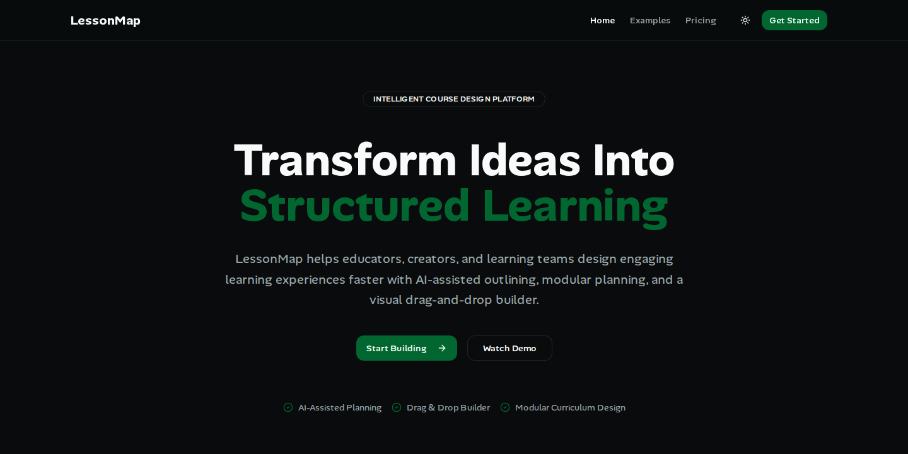
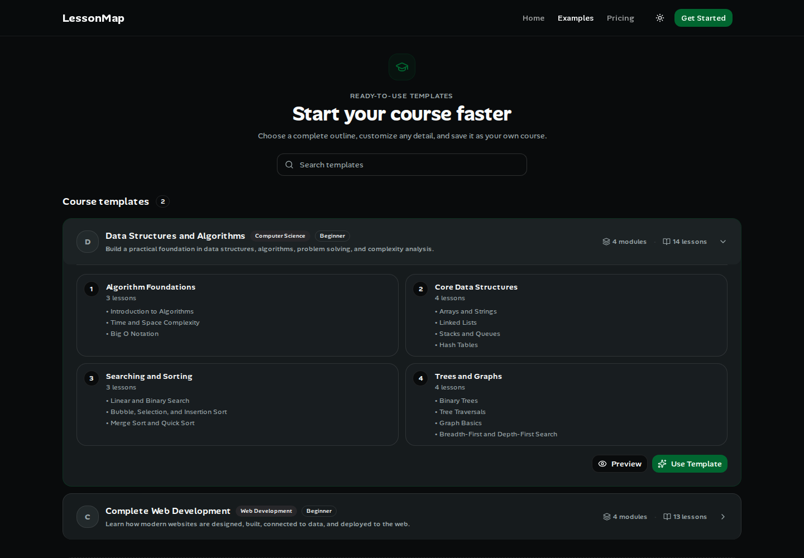
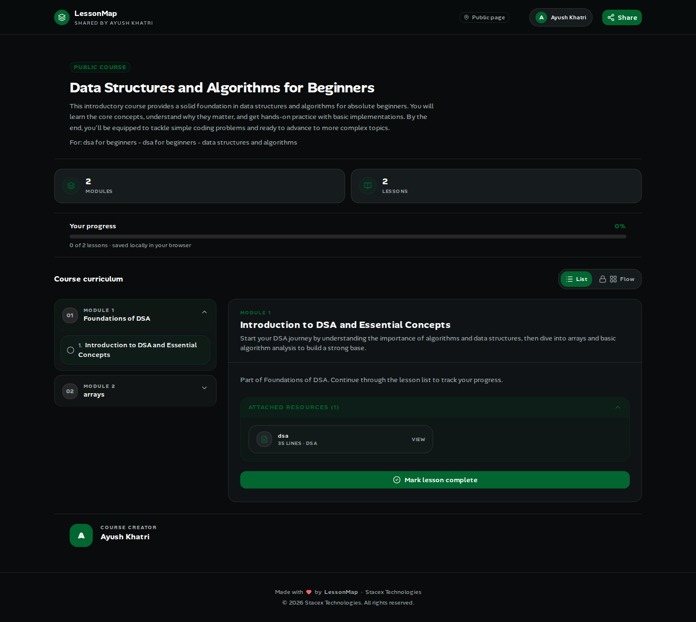
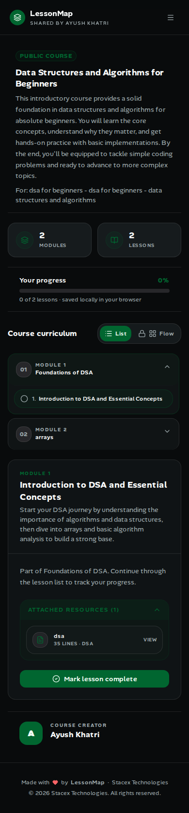

# LessonMap

### Turn your knowledge into a course people can follow.

Create a course outline, organize modules and lessons, attach learning resources, and share a public learning page—all in one workspace.

[Try LessonMap](https://lessonmap.vercel.app) · [Explore templates](https://lessonmap.vercel.app/examples) · [View plans](https://lessonmap.vercel.app/pricing) · [Report an issue](https://github.com/ayush-khatrii/Lesson-Map/issues)



Built for independent educators, bootcamp instructors, and creators who want a clear structure for their next course.

## From idea to shared course

1. **Start your outline.** Create a course manually, choose a ready-made template, or generate a draft with AI.
2. **Make it yours.** Edit course details, add modules and lessons, and drag them into the right order.
3. **Add useful material.** Attach code, notes, links, PDFs, or images to individual lessons.
4. **Share and learn.** Enable public sharing and send the link to learners. They can browse lessons and track completion in their browser.

## Features

| Feature | What you can do |
| --- | --- |
| **Course dashboard** | See your courses, module and lesson counts, and sharing status in one place. |
| **Course builder** | Create, edit, delete, and reorder modules and lessons in an accordion layout. |
| **AI course outlines** | Describe a topic and audience, choose an outline size, and generate an editable draft with DeepSeek. |
| **Starter templates** | Preview DSA and Web Development courses. **Use Template** pre-fills a new course with its modules and lessons. |
| **Lesson resources** | Attach code, notes, links, PDFs, and images. Browse resources with their lesson context and preview supported content. |
| **Code previews** | Read code resources with syntax highlighting in a scrollable preview. |
| **Public course pages** | Publish a stable share link with the original creator's name, course details, and curriculum. Turn sharing off when needed. |
| **Learner progress** | Mark lessons complete and follow the overall progress bar. Progress is saved locally in the current browser. |
| **Markdown export** | Paid subscribers can download their own saved course outline as a `.md` file from the builder's Settings tab. |
| **Responsive themes** | Browse courses on desktop or mobile with shared light and dark theme colors. |
| **GitHub sign-in** | Sign in to manage your own courses through Better Auth. |
| **Subscription billing** | Upgrade through Dodo Payments; verified subscription webhooks update paid access. |

### Start with a template

Explore the course structure before using it. Templates are defined in code; a course is stored in your account when you save it.



### Give learners a focused course page

Learners can move through modules, open lessons and their attached resources, and mark lessons complete. Public courses can be viewed without signing in.



<details>
<summary>See the mobile course page</summary>

<br />


</details>

Screenshots show the deployed public interface captured in September 2026. Available content may change as course owners edit their courses.

## Plans and usage

These limits reflect the current server configuration in [lib/plans.ts](lib/plans.ts) and [lib/ai/schema.ts](lib/ai/schema.ts). See the [pricing page](https://lessonmap.vercel.app/pricing) for subscription pricing.

| Allowance | Free | Creator |
| --- | --- | --- |
| Saved courses | 3 | 5 |
| Manually added modules and lessons | No plan-level cap | No plan-level cap |
| AI attempts per month | 5 | 200 |
| AI outline size | 1 module with 1 lesson | Configurable, within the request safety limit |
| Public course sharing | Yes | Yes |
| Markdown export | No | Yes |

An AI attempt is recorded when the server accepts and reserves a new generation request. Provider failures also count; rejected requests before reservation do not. Replaying the same request does not consume another attempt. The allowance resets at the start of each calendar month in UTC.

Each AI request allows up to **100 combined modules and lessons** to keep generation manageable. This does not limit how many items you can add manually afterward.

Markdown export includes the saved course title and description, module descriptions, and ordered lesson titles. It does not bundle resource files. The server checks the signed-in user's paid access and course ownership before returning the download.

## Current scope

LessonMap focuses on course planning and public lesson browsing. Progress is browser-local and does not sync between devices. Flow Map is currently a locked placeholder; PDF/Notion export, learner comments, and AI regeneration controls are not available features.

## Built with

| Area | Technology |
| --- | --- |
| Application | Next.js 16 App Router, React 19, TypeScript |
| Interface | Tailwind CSS 4, shadcn/ui, Radix UI, Lucide icons |
| Data | PostgreSQL, Prisma 7 |
| Authentication | Better Auth with GitHub OAuth |
| AI | DeepSeek with Zod-validated outline responses |
| Payments | Dodo Payments and signed webhooks |
| File storage | Cloudflare R2 through the AWS S3 SDK |
| Interaction | dnd-kit for reordering, Shiki for syntax highlighting |
| Caching | Next.js Cache Components with user-specific course tags |

## Run locally

Use Node.js 22 LTS, npm, and a PostgreSQL development database. GitHub OAuth is required for sign-in. AI, uploads, and payments need their corresponding service credentials.

### 1. Clone and configure

```bash
git clone https://github.com/ayush-khatrii/Lesson-Map.git
cd Lesson-Map
cp .env.example .env
```

The current `.env.example` contains payment settings but is not a complete environment template. Add the following variables to your local `.env` with your own values:

### 2. Install and prepare the database

```bash
npm ci
npx prisma db push
npx prisma generate
```

### 3. Start the app

```bash
npm run dev
```

Open [localhost:3000](http://localhost:3000), sign in, and create a course or try a template.

```text
https://your-domain/api/webhooks/dodopayments
```

Use that endpoint's signing secret, subscribe to the subscription lifecycle events handled by [the webhook route](app/api/webhooks/dodopayments/route.ts), and keep the API key, product IDs, and webhook configuration in the same test or live environment. Local webhook delivery requires a public tunnel.

For uploads, configure the R2 bucket's CORS rules for your app's origin. [cors.json](cors.json) contains the repository's current configuration; adapt its allowed origins to your environment.

### Useful commands

```bash
npm run typecheck  # Check TypeScript
npm run build     # Create a production build
npm start         # Serve the production build
```

## Project structure

```text
app/              Pages, layouts, and API routes
components/       Course builder, previews, dashboard, and shared UI
constants/        Static course templates and shared content
lib/              Auth, course actions, AI, caching, and storage helpers
prisma/           Database schema and migrations
public/           Static assets
docs/screenshots/ README product screenshots
tests/            Existing automated checks
```

## Feedback and contributions

Found a problem or have an idea? [Open an issue](https://github.com/ayush-khatrii/Lesson-Map/issues) with the steps to reproduce it, expected behavior, and a screenshot when useful. For contributions, keep changes focused and run the relevant checks before opening a pull request.

Created by [Ayush Khatri](https://github.com/ayush-khatrii), with contributions from [Vrut07](https://github.com/vrut07).

Licensed under the [MIT License](LICENSE).
